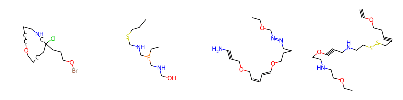
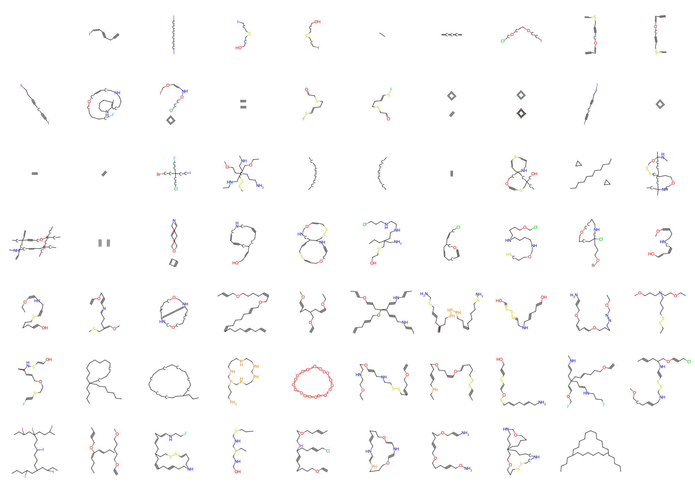
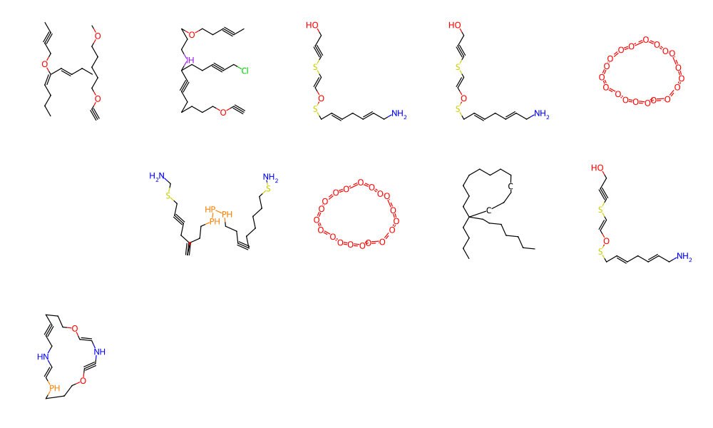
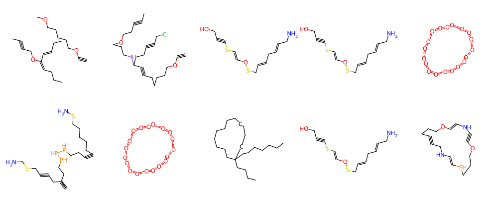

# Motivation

We all love rdkit, but hasn't it always been missing a 'MolFromText' function to turn text into structures?

Wouldn't that be cool? Anybody think so? Bueller? No?

Well, here is one anyway!

# Nuts and bolts

`mol_from_text` is a python module which enables representing text as molecules and includes:

- optional fun colors
- optional (even more) fun animations
- compatability with ASCII codes 32-126 (uppercase only; lowercase TBD)

Below are the supported characters and their representation:

    ~|}{`_^][\@?=><;:/.-,+*)('"'"'&%$#"!9876543210ZYXWVUTSRQPONMLKJIHGFEDCBA

# Installation

    git clone https://github.com/prheenan/mol_from_text.git
    cd mol_from_text
    conda install -f --yes env.yaml
    conda activate mol_ransom

# Usage

## Making images

Images can be created as follows:

`python mol_from_text.py image  --string 'helloworld'`

This yields the image below as `helloworld.svg`:

There are many options for modifying the image as given below:

    Usage: mol_from_text.py image [OPTIONS]

    Options:
      --string TEXT                   What string to convert to molecules
                                      [required]
      --output_file PATH              Name of output file (only png and svg
                                      supported)
      --black_and_white Choice([TRUE/True/FALSE/False])
                                      If true, use black and white instead of
                                      colors
      --comic_mode Choice([TRUE/True/FALSE/False])
                                      If true, use comic-drawing mode (xkcd style)
      --letters_per_row INTEGER       How many letters per row (i.e., line
                                      character limit)
      --one_word_per_line Choice([TRUE/True/FALSE/False])
                                      If true, have one word per row/line
                                      (equivalent to setting <letters_per_row> to
                                      the longest word length)
      --dots_per_angstrom FLOAT       See rdkit.Draw.MolDrawOptions
      --font_size INTEGER             See rdkit.Draw.MolDrawOptions
      --bond_width FLOAT              See rdkit.Draw.MolDrawOptions
      --scale FLOAT                   See rdkit.Draw.MolDrawOptions
      --letter_size_pixels INTEGER    Individual size of letters
      --help                          Show this message and exit.

## Making animations

Images can be created as follows:

`python mol_from_text.py animate  --string 'helloworld'`

This yields the image below as `helloworld.gif`:

There are many animations options as follows:

    Usage: mol_from_text.py animate [OPTIONS]

    Options:
      --output_file PATH              Name of output file (only gif supported)
      --string TEXT                   What string to convert to molecules
                                      [required]
      --black_and_white Choice([TRUE/True/FALSE/False])
                                      If true, use black and white instead of
                                      colors
      --comic_mode Choice([TRUE/True/FALSE/False])
                                      If true, use comic-drawing mode (xkcd style)
      --letters_per_row INTEGER       How many letters per row (i.e., line
                                      character limit)
      --one_word_per_line Choice([TRUE/True/FALSE/False])
                                      If true, have one word per row/line
                                      (equivalent to setting <letters_per_row> to
                                      the longest word length)
      --loop_forever Choice([TRUE/True/FALSE/False])
                                      If true, loop for forever, otherwise just
                                      will run once
      --and_reverse Choice([TRUE/True/FALSE/False])
                                      If true, animation will run in forward
                                      direction then in the reverse direction
      --total_time_s FLOAT            How long for total animation
      --rotation_degrees FLOAT        Total rotation in degrees
      --frames_per_second FLOAT       How many frames per second
      --start_degrees FLOAT           Where to start animation (0 = 12 o clock,
                                      -90 would be 9 o clock, +90 would be 3 o
                                      clock, etc)
      --dots_per_angstrom FLOAT       See rdkit.Draw.MolDrawOptions
      --font_size INTEGER             See rdkit.Draw.MolDrawOptions
      --bond_width FLOAT              See rdkit.Draw.MolDrawOptions
      --scale FLOAT                   See rdkit.Draw.MolDrawOptions
      --letter_size_pixels INTEGER    Individual size of letters
      --help                          Show this message and exit.

##  Getting a molfile

If you just want a molfile of all the letters and their structures, that is easy enough:

`python mol_from_text.py export-structures --output_file "mols.sdf"`

This will export an SDF which as a `ascii_character` property for each molecule containing its text

## Future directions

- Support for lowercase? (ASCII 97-122)
- Incorporate [NanoPutian](https://en.wikipedia.org/wiki/NanoPutian)?
